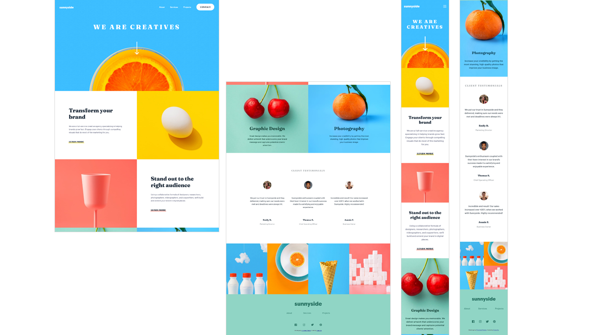

# Frontend Mentor - Sunnyside agency landing page solution

This is a solution to the [Sunnyside agency landing page challenge on Frontend Mentor](https://www.frontendmentor.io/challenges/sunnyside-agency-landing-page-7yVs3B6ef). Frontend Mentor challenges help you improve your coding skills by building realistic projects.

## Table of contents <!-- omit from toc -->

- [Overview](#overview)
  - [The challenge](#the-challenge)
  - [Screenshot](#screenshot)
  - [Links](#links)
- [My process](#my-process)
  - [Built with](#built-with)
  - [What I learned](#what-i-learned)
  - [Useful resources](#useful-resources)
- [Author](#author)

## Overview

### The challenge

Users should be able to:

- View the optimal layout for the site depending on their device's screen size
- See hover states for all interactive elements on the page

### Screenshot



### Links

- Solution URL: [https://www.frontendmentor.io/solutions/sunnyside-agency-landing-page-using-bootstrap-and-scss-K0_3ysiAer](https://www.frontendmentor.io/solutions/sunnyside-agency-landing-page-using-bootstrap-and-scss-K0_3ysiAer)
- Live Site URL: [https://yingjhen-su.github.io/frontend-mentor_sunnyside-agency/](https://yingjhen-su.github.io/frontend-mentor_sunnyside-agency/)

## My process

### Built with

- Semantic HTML5 markup
- [Bootstrap 5](https://getbootstrap.com/)
- [sass/SCSS](https://sass-lang.com/)
- CSS Flexbox
- Mobile-first workflow
- Javascript

### What I learned

- use html5 picture element
```html
<picture>
  <source srcset="images/desktop/image-transform.jpg" media="(min-width: 768px)">
  
</picture>
```

- use Bootstrap Grid system & Utility API
```html
<div class="row justify-content-center g-0">
  <div class="col-12 col-md-4">
    <div class="footer__logo w-50 mx-auto mb-10">
      
    </div>
```

- override Bootstrap variables
```scss
$primary:       hsl(212, 27%, 19%);
$secondary:     hsl(213, 9%, 39%);
$ss-gray:       hsl(232, 10%, 55%);
$ss-fade:       hsl(210, 4%, 67%);
$ss-link:       hsl(228, 45%, 44%);
$ss-green:      hsl(167, 40%, 24%);
$ss-blue:       hsl(198, 62%, 26%);

$spacers: (
  0:  0,
  1:  $spacer * .25,
  2:  $spacer * .5,
  3:  $spacer * .75,
  4:  $spacer,
  5:  $spacer * 1.25,
  6:  $spacer * 1.5,
  7:  $spacer * 1.75,
  8:  $spacer * 2,
  9:  $spacer * 2.25,
  10: $spacer * 2.5,
  11: $spacer * 2.75,
  12: $spacer * 3,
  13: $spacer * 3.25,
  14: $spacer * 3.5,
  15: $spacer * 3.75,
  16: $spacer * 4,
  17: $spacer * 5,
  18: $spacer * 6,
  19: 5vw,
  20: 10vw
);
```

- use sass/SCSS
```scss
.text {
    &-h1 {
        font-size: $FS-H1;
        @include lg {
            font-size: $FS-H1-LG;
        }
    }
}
```

- use css transition
```scss
.menu {
    &__mobile {
        width: 88%;
        height: 20rem;
        top: -500px;
        left: calc(12% / 2);
        transition: all 0.3s ease-in-out;

        &.active {
            top: calc(100% + 1rem);
        }
    } 
}
```

### Useful resources

- [金魚都能懂的Bootstrap5網頁框架開發](https://www.youtube.com/playlist?list=PLqivELodHt3jq3oWBZfdhMu0GE7774HBW) - A great series of video courses to learn Bootstrap.
- [BS5 使用 SCSS 覆蓋新增Variable](https://hoyis-note.coderbridge.io/2021/06/01/BS5-SCSS/) - A great article to learn how to override Bootstrap variables.
- [SASS教學 ＋SCSS：CSS 再進化，掌握語法攻略！](https://frankknow.com/sass-tutorial/) - A great article which helped me understand sass/SCSS.

## Author

- Frontend Mentor - [@YingJhen-Su](https://www.frontendmentor.io/profile/YingJhen-Su)
